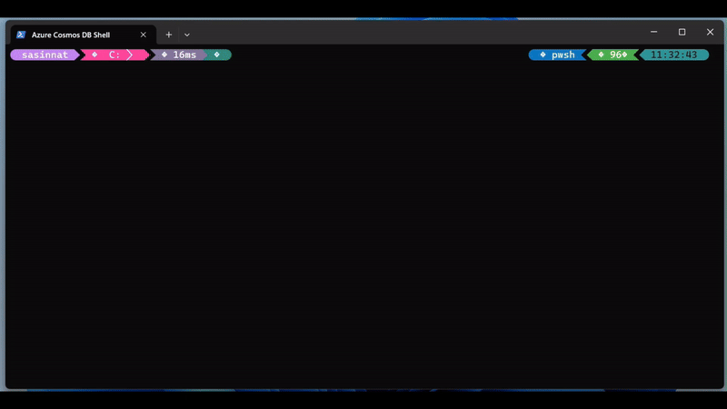

# Azure Cosmos DB Shell

A terminal-native shell for Azure Cosmos DB — navigate databases like a filesystem, query interactively, and script with variables, loops, and functions. Supports Entra ID, MCP for AI tool integration, and works with the local emulator.



## Features

- Connect via Entra ID, connection string, or Azure CLI/Developer tools
- Navigate with `ls` and `cd` (Account -> Databases -> Containers -> Items)
- Inspect the current location with `pwd`
- Create, query, replace, patch, delete: `mkdb`, `mkcon`, `mkitem`, `query`, `replace`, `patch`, `rm`
- Bulk roundtrip with `import` / `export` for JSON Lines and JSON array files, plus CSV import/export (CSV import coerces values to strings; `--partition-key` nests a CSV column under a nested partition key path)
- Manage container indexing policies with `index` (`show`, `add`, `remove`, `set`)
- Manage stored procedures with `sproc` (`list`, `show`, `exists`, `create`, `exec`, `edit`, `delete`)
- Tail the change feed of a container with `watch` (alias `tail`)
- Database and container management commands prefer Azure Resource Manager when connected with Entra ID, with data-plane fallback for key, emulator, and static-token connections
- Pipelines and scripting with variables, loops, functions
- Multi-line input at the prompt — automatic continuation for unclosed blocks/strings, plus explicit `\` line continuation ([docs](docs/navigation.md#multi-line-input))
- MCP server for AI/tool integration
- Distributed tracing via OpenTelemetry (`--otel`): emits a sampled W3C `traceparent` on Cosmos requests, with optional OTLP export

## Quick Start

**Requirements:** .NET SDK 10.0+.

The .NET runtime alone is not enough for the commands below. `dotnet run` and `dotnet tool install` are SDK commands. To verify the SDK is installed, run `dotnet --list-sdks`.

```bash
dotnet run --project CosmosDBShell
```

**Example session:**

```text
connect "AccountEndpoint=...;AccountKey=..."
ls                          # list databases
cd MyDatabase
ls                          # list containers
cd MyContainer
query "SELECT * FROM c"
```

## Build from Source

```bash
git clone https://github.com/Azure/CosmosDBShell.git
cd CosmosDBShell
dotnet build CosmosDBShell.sln
dotnet run --project CosmosDBShell/CosmosDBShell.csproj
```

Run the tests:

```bash
dotnet test CosmosDBShell.sln
```

## Architecture

| Folder | Purpose |
| ------ | ------- |
| `CosmosDBShell/Azure.Data.Cosmos.Shell.ArgumentParser/` | Command-line argument parsing |
| `CosmosDBShell/Azure.Data.Cosmos.Shell.Commands/` | Each shell command is a class (`ls`, `cd`, `query`, `mkitem`, etc.) |
| `CosmosDBShell/Azure.Data.Cosmos.Shell.Core/` | Interpreter, state machine, command runner |
| `CosmosDBShell/Azure.Data.Cosmos.Shell.Parser/` | Lexer and AST for shell syntax |
| `CosmosDBShell/Azure.Data.Cosmos.Shell.States/` | Shell states (disconnected, connected, in database, in container) |
| `CosmosDBShell/Azure.Data.Cosmos.Shell.Mcp/` | MCP server for AI/tool integration |
| `CosmosDBShell/Azure.Data.Cosmos.Shell.Lsp/` | LSP server for editor integration |
| `CosmosDBShell/Azure.Data.Cosmos.Shell.Lsp.Semantics/` | Semantic analysis for the LSP server |
| `CosmosDBShell/Azure.Data.Cosmos.Shell.Util/` | Shared utilities (localization, pattern matching, etc.) |
| `CosmosDBShell/Azure.Data.Cosmos.Shell.KeyBindings/` | Key binding definitions |
| `CosmosDBShell/lang/` | Localization files (Fluent `.ftl` format) |
| `CosmosDBShell.Tests/` | Unit and integration tests |
| `docs/` | User-facing documentation |

<details>
<summary><strong>Install from NuGet package artifacts</strong></summary>

When consuming build artifacts (`*.nupkg`) from this repo, install as a .NET global tool.

`dotnet tool install` for these packages requires the .NET SDK 10.0+ because the tool packages target `net10.0`. Installing only the .NET runtime does not provide the `dotnet tool` command.

1. Download the base tool package (`CosmosDBShell.<version>.nupkg`) and the package for your runtime to the same local folder.
2. Install from that folder with `--add-source` using the base package ID `CosmosDBShell`.

#### Runtime-specific package files

- Linux x64: `CosmosDBShell.linux-x64.<version>.nupkg`
- Linux ARM64: `CosmosDBShell.linux-arm64.<version>.nupkg`
- macOS x64: `CosmosDBShell.osx-x64.<version>.nupkg`
- macOS ARM64: `CosmosDBShell.osx-arm64.<version>.nupkg`
- Windows x64: `CosmosDBShell.win-x64.<version>.nupkg`
- Windows ARM64: `CosmosDBShell.win-arm64.<version>.nupkg`

#### Install command

After placing the base package and the matching runtime package in the same folder, install with the base package ID:

```bash
dotnet tool install --global CosmosDBShell --add-source /path/to/nupkgs --version <version>
```

Windows PowerShell example:

```powershell
dotnet tool install --global CosmosDBShell --add-source C:\path\to\nupkgs --version <version>
```

#### Use, update, uninstall

Run the tool:

```bash
cosmosdbshell
```

Update:

```bash
dotnet tool update --global <package-id> --add-source /path/to/nupkgs --version <new-version>
```

Uninstall:

```bash
dotnet tool list --global
dotnet tool uninstall --global CosmosDBShell
```

</details>

## Documentation

- [Connection](docs/connect.md) - Authentication and connection options
- [Commands](docs/commands.md) - All shell commands
- [Navigation](docs/navigation.md) - Navigation, pipes, CLI arguments
- [Programming](docs/programming.md) - Variables, control flow, functions
- [Filter expression language (v1)](docs/filter-v1-spec.md) - Grammar and semantics of the built-in `filter` command
- [MCP](docs/mcp.md) - Model Context Protocol integration

## CI And Packaging

This repo currently uses one GitHub Actions workflow for validation and package artifacts:

- [.github/workflows/validate-and-package.yml](.github/workflows/validate-and-package.yml): runs validation on pull requests, and on branch pushes or manual runs it also builds installable RID-specific NuGet tool packages and uploads them as workflow artifacts

Local builds and GitHub Actions use the default NuGet sources (nuget.org). The Azure DevOps pipeline uses a restricted config at [.pipelines/nuget.config](.pipelines/nuget.config) that limits restores to the internal feed.

Packaging runs produce preview versions in the form `1.0.<run>-preview.<branch>`, upload separate artifacts for each RID-specific package plus a pointer/base package artifact for the non-RID package ID, and the Azure pipeline publishes both the base package and the RID-specific packages to the internal feed.

## Command-Line Arguments

| Option | Description |
| ------ | ----------- |
| `-c <cmd>` | Execute and exit |
| `-k <cmd>` | Execute and stay |
| `--connect <str>` | Connection string or endpoint URL |
| `--connect-tenant <id>` | Entra ID tenant for interactive login |
| `--connect-hint <email>` | Login hint for interactive login |
| `--connect-authority-host <uri>` | Authority host (e.g. sovereign clouds) |
| `--connect-managed-identity <id>` | Use a user-assigned managed identity |
| `--connect-subscription <id>` | Azure subscription ID for ARM database and container operations |
| `--connect-resource-group <name>` | Azure resource group name for ARM database and container operations |
| `--mcp [port]` | Enable MCP server on the given port, or `6128` by default |
| `--diagnostics [path]` | Write timestamped diagnostic logs to a file, or to a timestamped file in the config directory by default |
| `--otel [endpoint]` | Enable distributed tracing (sampled W3C `traceparent`); optional OTLP `endpoint`, else `OTEL_EXPORTER_OTLP_ENDPOINT` |
| `--verbose` | Print full exception details |
| `--color-system <n>` | Colors: 0=off, 1=standard, 2=truecolor (alias: `--cs`) |
| `--theme <name>` | Color theme profile to apply at startup (`default`, `light`, `dark`, `monochrome`). Falls back to `COSMOSDB_SHELL_THEME`. |
| `--help` | Show help |

Examples:

```bash
# Run a script and exit. Script arguments become $1, $2, ... inside the script.
cosmosdbshell --connect "AccountEndpoint=...;AccountKey=..." -c "seed.csh mydb mycontainer"

# -c also accepts an unquoted command tail; everything after -c becomes the
# command, so app-level options (like --connect) must come BEFORE -c.
cosmosdbshell --connect "AccountEndpoint=...;AccountKey=..." -c seed.csh mydb mycontainer

# Run a script from piped command text.
echo "seed.csh mydb mycontainer" | cosmosdbshell --connect "AccountEndpoint=...;AccountKey=..."
```

## Theming

The shell ships with four built-in color profiles that can be selected at startup or swapped at runtime:

| Profile | Best for |
| ------- | -------- |
| `default` | Dark terminal backgrounds (alias for `dark`). |
| `dark` | Dark terminal backgrounds. |
| `light` | Light terminal backgrounds (uses darker hues for brackets and literals so they remain readable on white). |
| `monochrome` | No color escapes; only `bold`/`dim`/`underline`. Useful for screen readers, monochrome terminals, or piping to a log file. |

All profiles use only the standard ANSI 16 color names, so the shell follows the terminal's configured palette (Solarized, Dracula, Campbell, …).

```bash
# Pick a profile at startup.
cosmosdbshell --theme=light

# Or via environment variable (the --theme flag wins if both are set).
export COSMOSDB_SHELL_THEME=monochrome
cosmosdbshell

# Inspect or switch at runtime.
❯ theme list
❯ theme show light       # preview a profile without switching
❯ theme use light        # switch for the rest of the session
```

### Custom themes

Place TOML files under `~/.cosmosdbshell/themes/` (Windows: `%USERPROFILE%\.cosmosdbshell\themes`). They are scanned at startup and appear alongside the built-ins in `theme list` and `--theme=<name>`. Files may shadow built-ins by name (a warning is emitted).

A theme file overlays a base profile via `extends` (defaults to `default`). Only the keys you want to change are required:

```toml
name        = "solarized-light"
description = "Solarized-style light palette"
extends     = "default"

[colors]
literal           = "purple"
container_name    = "purple"
connected_prompt  = "navy"
json_property     = "navy"
help_accent       = "navy"
directory         = "navy"
operator          = "navy"
bracket_cycle     = ["purple", "maroon", "navy"]

[styles]
help_header     = "bold"
unknown_command = "bold red"
```

Color values must be empty or one standard ANSI 16 color name (`black`, `maroon`, `green`, `olive`, `navy`, `purple`, `teal`, `silver`, `grey`, `red`, `lime`, `yellow`, `blue`, `fuchsia`, `aqua`, `white`). Style values may combine modifiers (`bold`, `dim`, `italic`, `underline`, `strikethrough`, `invert`, `conceal`, `slowblink`, `rapidblink`) with at most one ANSI 16 color. Empty string means "use the terminal's default foreground".

Runtime commands for working with files:

```bash
❯ theme load ./my-theme.toml         # load and switch to a file ad-hoc
❯ theme validate ./my-theme.toml     # validate a file without loading or switching
❯ theme validate ~/.cosmosdbshell/themes  # validate every TOML file in a directory
❯ theme validate my-theme --strict   # treat warnings as errors
❯ theme save my-theme                # write the active theme to ~/.cosmosdbshell/themes/my-theme.toml
❯ theme save my-theme ./out.toml     # save to a custom path
❯ theme save my-theme --force        # overwrite an existing file
❯ theme reload                       # rescan the user themes directory
```

`theme save` writes a self-contained theme file with every color and style slot populated, so the saved file can be moved or edited without depending on another custom profile.

## How to Contribute

We welcome contributions! See [CONTRIBUTING.md](./CONTRIBUTING.md) for ways to help, project architecture, and PR guidelines.

- [Code of Conduct](./CODE_OF_CONDUCT.md)
- [Security](./SECURITY.md)

## Telemetry

**Azure Cosmos DB Shell does not collect any telemetry.** The CLI does not emit usage data, crash reports, or diagnostic information to Microsoft or any third party. There is no opt-out switch because there is nothing to opt out of — no telemetry SDK is bundled, and no network calls are made other than the requests you explicitly issue against your Azure Cosmos DB account (or local emulator) and, when Entra ID or other credential-based authentication is used, the identity endpoints required to obtain a token, including managed identity endpoints.

**Server-side data collected by Azure.** When you connect the Shell to an Azure Cosmos DB account, every request you send (read, query, create, replace, patch, delete, container/database management, etc.) is processed by the Azure Cosmos DB service. As with any client (SDKs, REST, Data Explorer, or this Shell), the service records operational data on the backend so that you and Microsoft can monitor, bill, and support the account. This includes:

- **Platform metrics and resource logs** — request counts, RU/s consumption, latency, status codes, partition key statistics, throttling events, and similar signals available through Azure Monitor. See [Monitor Azure Cosmos DB](https://learn.microsoft.com/azure/cosmos-db/monitor) and [Monitor data reference](https://learn.microsoft.com/azure/cosmos-db/monitor-reference).
- **Diagnostic logs** — `DataPlaneRequests`, `QueryRuntimeStatistics`, `ControlPlaneRequests`, and other categories, but only if you enable diagnostic settings on the account and route them to a Log Analytics workspace, storage account, or event hub. See [Monitor data by using diagnostic settings](https://learn.microsoft.com/azure/cosmos-db/monitor-resource-logs).
- **Activity log** — control-plane operations against the account (created/updated/deleted resources) recorded by Azure Resource Manager. See [Azure activity log](https://learn.microsoft.com/azure/azure-monitor/essentials/activity-log).
- **Authentication telemetry** — Entra ID authentication events may be recorded by Microsoft Entra in sign-in logs, depending on the credential flow (including user and service principal sign-ins), independent of Azure Cosmos DB.

This server-side collection is a property of the Azure Cosmos DB service itself, not of this Shell, and the same data would be recorded if the same operations were issued from any other client. It is governed by the [Microsoft Privacy Statement](https://go.microsoft.com/fwlink/?LinkID=521839), the [Microsoft Product Terms](https://www.microsoft.com/licensing/terms/), and the [Azure Trust Center](https://www.microsoft.com/trust-center). For details on what is logged, retention, and how to control it for your account, review the Azure Cosmos DB monitoring documentation linked above.

## License

[MIT](LICENSE.md)
